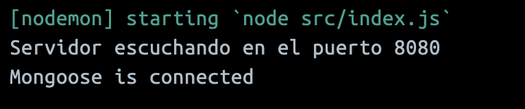

# challenge-justiniano

## Descripción
Este proyecto se encarga de la gestión de restaurantes y productos del menú.

## Pre-requisitos
Para la correcta ejecución de la aplicación es necesario tener instalado:
* Docker
  * Windows/Mac: `https://www.docker.com/get-started`
  * Linux: `https://docs.docker.com/engine/install/`
* Postman: `https://postman.com/downloads/`

## Instalacion
1. Clonar el repositorio: 
```
git clone https://github.com/debora2004/challenge-justiniano.git
```
2. Abrir Docker
3. Ejecutar la aplicación:
   + Windows/Mac: `docker-compose up -d`
   + Linux: `docker compose up -d`
4. Esperar a que la aplicación se inicie.
5. Entrar a los logs container Web dentro de Docker.
6. Verificar que aparezca el mensaje **"Mongoose is connected"**. Este mensaje indica que la base de datos se ha conectado correctamente.
   


## Uso
1. Importa el archivo "Restaurant - N1U.postman_collection.json" en Postman.
2. Selecciona la carpeta "Class Restaurant" y ejecuta la llamada de la API: "Crear Restaurante".
3. Observa cómo se crea un nuevo restaurante mediante la response de la API.
4. Repite los pasos 3 y 4 para las demás carpetas y tests.
   
## Entornos
Postman permite usar entornos para definir variables que se pueden usar en las pruebas. Esto ayuda a organizar y mantener las pruebas, y a facilitar su ejecución en diferentes escenarios.

En este proyecto, se ha configurado un entorno con las siguientes variables:

+ **ID_RESTAURANT:** ID de un restaurante de prueba.
+ **ID_PRODUCT:** ID de un producto de prueba.
Está funcionalidad se configuró dentro de la API Crear Restaurante y Crear Producto, en la sección Tests:
    ```js
        let jsonData = pm.response.json();
        let id = jsonData._id;
        pm.globals.set("id_restaurant", id);
    ```
Para usar las variables en las pruebas, se debe usar la sintaxis {{variable}}. Por ejemplo, en la prueba "Crear Restaurante", se usa la variable 
**{{id_restaurant}}** para construir la URL de la API.

## Ventajas de usar entornos:
+ Organización: Me permitó organizar las variables de prueba en un solo lugar.
+ Mantenimiento: Me facilitó el mantenimiento de las pruebas al centralizar las variables.
+ Reutilización: Me permitió reutilizar las variables en diferentes pruebas.
+ Flexibilidad: Me permitió ejecutar las pruebas en diferentes escenarios modificando las variables.

## API
### Endpoints Restaurant:
1. POST http://localhost:8080/restaurant : Se encarga de registrar un restaurante. Desde la solapa body seleccionar el formato "form-data". Se requiere ingresar:
    * name 
    * address
    * operating_hours
    * photo (png o jpg)
2. PUT  http://localhost:8080/restaurant/{{id_restaurant}} : Se encarga de actualizar un restaurante. Desde la solapa body seleccionar el formato "form-data". Se requiere ingresar:
    * name 
    * address
    * operating_hours
    * photo (png o jpg)
3. GET http://localhost:8080/restaurant/{{id_restaurant}} : Se encarga de obtener un restaurante por medio de su id. 
4. GET http://localhost:8080/restaurant : Se encarga de listar todos los restaurantes existentes.
5. DELETE http://localhost:8080/restaurant/{{id_restaurant}} : Se encarga de eliminar un restaurante por id.

### Endopoints Product:
1. POST http://localhost:8080/product/{{id_restautant}} : Se encarga de registrar un producto asociado a un restaurante. Desde la solapa body seleccionar el formato "form-data". Se requiere ingresar:
    * name
    * price
    * category
    * special_offer
    * price_offer
    * day_offer
    * offer_schedule
    * photo (png o jpg)
2. PUT http://localhost:8080/product/{{id_product}} : Se encarga de actualizar un producto. Desde la solapa body seleccionar el formato "form-data". Se requiere ingresar:
    * name
    * price
    * category
    * special_offer
    * price_offer
    * day_offer
    * offer_schedule
    * photo (png o jpg)
    * restaurantId
3. GET http://localhost:8080/product/{{id_product}} : Se encarga de obtener un producto por medio de su id.
4. GET http://localhost:8080/product/ : Se encarga de listar todos los productos.
5. DELETE http://localhost:8080/product/{{id_product}} : Se encarga de eliminar un producto por medio de su id.